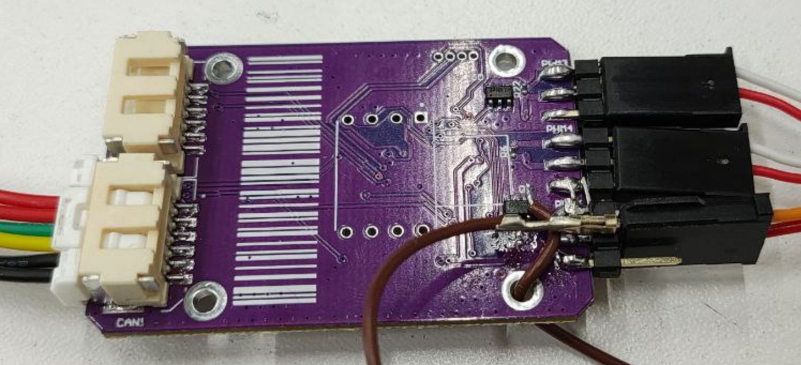
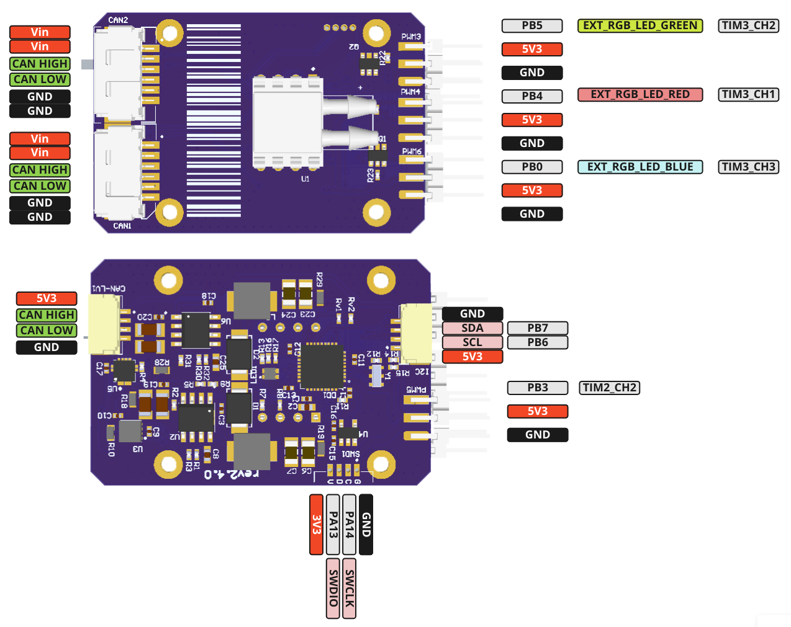

 

# VTOL Lights DroneCAN application

> Developers docs: [DroneCAN template application](https://github.com/RaccoonlabDev/mini_v2_node/wiki/dronecan).

### 1. Key features

- You can run the software in SITL mode (don't need to have any hardware),

### 2. Brief hardware info

| View | Drw |
| ---- | ------ |
|  |  |

### 3. Application interface

The node subscribes on [LightsCommand](https://dronecan.github.io/Specification/7._List_of_standard_data_types/#lightscommand) and blinks the external LEDs with PWM.

The node has the following parameters:
The node has the following registers:

| №  | Register name           | Description |
| -- | ----------------------- | ----------- |
|  1 | uavcan.node.id          | Defines a node-ID. Allowed values [0,127]. |
|  2 | system.name             | Defines custom node name. If empty, the node will use the default name. |
|  3 | lights.max_intensity    | Defines the max intensity of the lights. |
|  4 | lights.default_color    | Defines a default color of the lights. |
|  5 | lights.type             | Defines an intensity transition rate of the lights. |
|  6 | lights.blink_period_ms  | Defines a blink period of the lights [ms]. |
|  7 | lights.duty_cycle_pct   | Defines a duty cycle of the lights [%]. |
<!-- 
- lights.max_intensity
- lights.default_color
- lights.type
- lights.blink_period_ms
- lights.duty_cycle_pct -->
